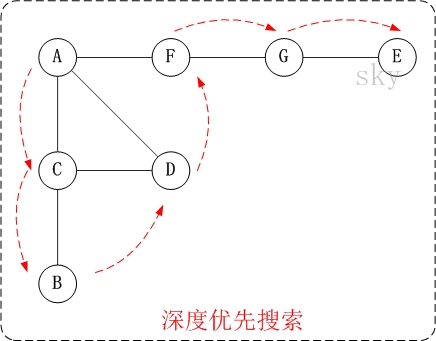
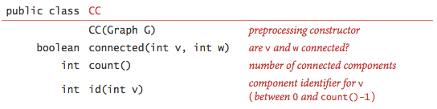
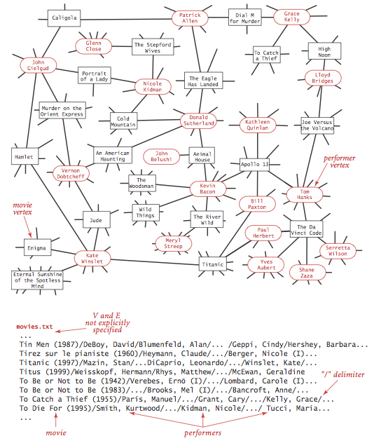

### Graphs
A graph is a set of *vertices* and a collection of *edges* that each connect a pair of vertices. We use the names 0 through V-1 for the vertices in a V-vertex graph

 

### Glossary:Here are some definitions that we use
* A self-loop is an edge that connects a vertex to itself
* Two edges are parallel if they connect the same pair of vertices
* When an edge connects two vertices, we say that the vertices are adjacent to one another and that the edge is incident on both vertices.
* The degree of a vertex is the number of edges incident on it.
* A subgraph is a subset of graph's( and associated vertices) that constitutes a graph.
* A cycle is a path (with at least one edge) whose first and last vertices are the same. A simple cycle is a cycle with no repeated edges or vertices (expect thr requisite repetition of the first and last vertices)
* The length of a path or a cycle is its number of edges.
* We say that one vertex is connected to another if there exists a path that contains both of them.
* A graph is connected if there is a path from every vertex to every other vertex.
* A Graph that is bot connected consists of sa set of connected components,which are maximal connected subgraphs.
* An acyclic(无环) graph is a graph with no cycles.
* A tree is an acyclic connected graph.
* A forest is a disjoint set of trees.
* A spanning tree of a connected graph is a subgraph that contains all of that graph's vertices and is a single tree. A spanning forest of a graph is the union of the spanning trees of its connected components.
* A bipartite graph is a graph whose vertices we can divide into two sets such that all edges connect a vertex in one set with a vertex in the other set. 

 

### Undirected graph data type. 
We implement the following undirected graph API. 

 

The key method adj() allows client code to iteratr through the vertices adjacent to a given vertex. Remarkably, we can build all of the algorithms that we consider in this section on the basic abtraction embodied in adj()

we prepare the test data [tinyG.txt](https://algs4.cs.princeton.edu/41graph/tinyG.txt),[mediumG.txt](https://algs4.cs.princeton.edu/41graph/mediumG.txt),and [largeG.txt](https://algs4.cs.princeton.edu/41graph/largeG.txt),using the following input file format

 

[GraphClient.java](https://algs4.cs.princeton.edu/41graph/GraphClient.java.html) contains typical graph-processing code. 

### Graph representation. 
We use the adjacency-lists representation, where we maintain a vertex-indexed array of lists of the vertices connected by an edge to each vertex. 

 

[Graph.java](https://algs4.cs.princeton.edu/41graph/Graph.java.html) implements the graph API using the adjacency-lists representation. [AdjMatrixGraph.java]() implements the same API using the adjacency-matrix representation. 

### Depth-first search.
Depth-first search is a classic recursive method for systematically examining each of  the vertices and edges in a graoh. To visit a vertex 
* Matk it as having been visited
* Visit(recursively) all the vertices that are adjacent to it and that have not yet been marked.

[DepthFirstSearch.java]() implements this approach and the following API:

 

 

### Finding Paths
It is easy to modify depth-first search to not only determine whether there exists a path between two given vertices but to find such a path
(if one exists). we seek to implements the following API:

 

To accomplish this,we remember the edge v-w that takes us to each vertex w for the first time by setting edgeTo[w] to v.In other words,
v-w is the last edge on the known path from s to w. The result of search is a tree rooted at the source; edgeTo[] is a parent-link representation of that tree.
[DepthFirstPaths.java]() implement this approach.

### Breadth-first search
Depth-first search finds some pat from a source verrex s to a target vertex v. We are often interested in finding the shortest such
path(one with a minimal number of edges). Breadth-first search is a classic method based on this goal. To find a shortest path from
s to v, we start at s and check for v among all the vertices that we can reach by following one edge, then we check for v among all the vertices
that we can reach from s by following two edges,and so forth.

To implement this strategy, we maintain a queue of all vertices that have been marked but whose adjacency lists have not been checked. we
put the source vertex on the queue,then perform the following steps until the queue is empty:
* remove the next vertex v from the queue
* put onto the queue all unmarked vertices that are adjacent to v and mark them.
[BreadthFirstPaths.java]() is an implememntation of the Paths API that finds a shotest paths. It relies on [Queue.java]() for the FIFO queue.

### 联通图
[Connected components](). Our next direct application of depth-first search is to find the connected components of a graph. Recall from Section 1.5 that "is connected to" is an equivalence relation that divides the vertices into equivalence classes (the connected components). 
For this task, we define the following API: 

 

### Symbol graphs. 
Typical applications involve processing graphs using strings, not integer indices, to define and refer to vertices. 
To accommodate such applications, we define an input format with the following properties: 

* Vertex names are strings.
* A specified delimiter separates vertex names (to allow for the possibility of spaces in names).
* Each line represents a set of edges, connecting the first vertex name on the line to each of the other vertices named on the line. 

The input file [routes.txt](https://algs4.cs.princeton.edu/41graph/routes.txt) is a small example. 

 

The input file [movies.txt](https://algs4.cs.princeton.edu/41graph/movies.txt) is a larger example from the Internet Movie Database. 
This file consists of lines listing a movie name followed by a list of the performers in the movie. 

 

API. The following API allows us to use our graph-processing routines for such input files. 

 

Implementation. [SymbolGraph.java](https://algs4.cs.princeton.edu/41graph/SymbolGraph.java.html) implements the API. It builds three data structures:

    A symbol table st with String keys (vertex names) and int values (indices)

    An array keys[] that serves as an inverted index, giving the vertex name associated with each integer index

    A Graph G built using the indices to refer to vertices
     

 
